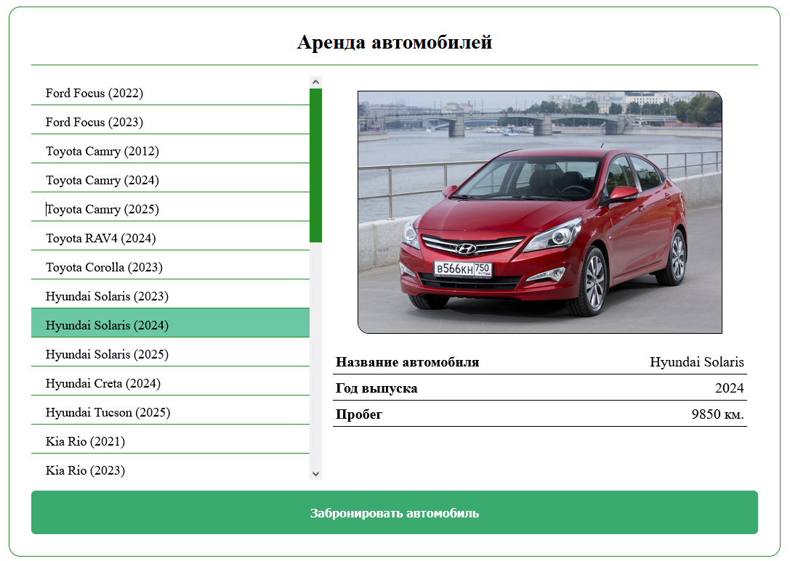

# Каршеринг

Веб-приложение с базовой логикой каршеринга: просмотр автомобилей, mock-аренда авторизация.

## Стек технологий

| Слой | Технологии |
|---|---|
| Backend | Python, Django REST Framework |
| Frontend | JavaScript, Vue.js |
| Reverse proxy | Nginx |
| Окружение | Docker, Docker Compose |

## Скриншоты

| Главная страница | Страница аренды |
|---|---|
|  |  |

## Реализованная логика

### Авторизация
Реализована полноценная аутентификация. Пользователь входит автоматически при запуске сайта.
Полноценная аутентификация запланирована в следующих итерациях.

### REST API
Реализованы два основных ресурса:
- `GET /api/v1/cars/` — список доступных автомобилей
- `POST /api/v1/cars/{car_id}/rentals/` — создание аренды
- `GET /api/v1/cars/{car_id}/rentals/{id}/` — статус текущей аренды

### Полный цикл аренды (mock)
Аренда проходит через четыре последовательных состояния:

1. **Бронь** — автомобиль резервируется за пользователем
2. **Осмотр** — пользователь подтверждает состояние автомобиля
3. **Аренда** — поездка активна
4. **Завершение** — автомобиль возвращён, аренда закрыта

Вся логика переходов между состояниями реализована на стороне backend через DRF.

### Архитектура
```
Браузер → Nginx (reverse proxy) → Vue.js (SPA) → DRF API → PostgreSQL
```

## Запуск

Убедитесь, что установлен и запущен Docker Engine.

```bash
# 1. Клонируйте репозиторий
git clone https://github.com/CucumentoJolaz/Carsharing

# 2. Перейдите в папку проекта
cd Carsharing

# 3. Скопируйте файл .env
cp  .env.example .env

# 4. Соберите и запустите контейнеры
docker compose up --build -d
```

После запуска откройте браузер и перейдите по адресу: `http://localhost:8080`

## Наиболее интересный код

- `backend/cars/` — логика API и переходов состояний аренды
- `frontend/src/` — компоненты Vue и роутинг

## Планы по развитию

**Backend**
- Интеграция Celery для управления жизненным циклом аренды в реальном времени
- API аналитики автомобилей и активности пользователей

**Frontend**
- Полноценная аутентификация (регистрация, вход, смена пароля)
- Страница аналитики на базе backend API

## Лицензия

[GNU General Public License (GPL)](https://www.gnu.org/licenses/gpl-3.0.html)