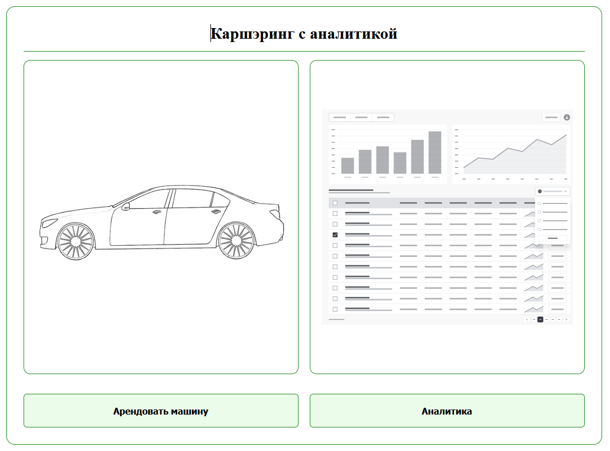

# Каршеринг

## Описание
Настоящее приложение реализует примитивную систему каршеринга с возможностью мок-аренды автомобилей. 
Раздел аналитики в разработке.
Приложение реализовано в виде вэб сервера состоящего из нескольких подпрограмм расположенных в нескольких контейнерах.

Основные использованные технологии в проекте:
1. backend - python, Django Rest Framework
2. frontend - JavaScript, Vue.js
3. reverse proxy - nginx
4. envinronment - Docker

Наиболее интересный код:
* backend/cars/ 
*  frontend/src/

## Запуск приложения

Для работы с приложением убедитеcь что у вас установлен и корректно работает Docker Engine.
Для запуска приложения следуйте следующей инструкции:

1. Клонируйте репозиторий себе на компьютер.
`git clone https://github.com/CucumentoJolaz/Carsharing`

2. Перейдите в терминале в созданную папку с кодом проекта
`cd Carsharing`

3. Запустите сборку и запуск контейнеров с помощью приложения Docker Compose
`docker compose up --build -d`

4. По окончанию сборки и запуска откройте брайзер и перейдите на ссылку
`http://localhost:8080` для работы с приложением.

## Реализованная логика

## TO-DO лист
### Backend
- [x] API автомобилей

- [x] API аренд

### Frontend
- [x] Главная страница, Main page
- [x] Страница аренды
- [ ] Страница аналитики. 
1. РЕАЛИЗОВАН ТОЛЬКО STUB
2. Сформулировать требуемую аналитику для поведения пользователей на сайте/аренд автомобилей
- [x] Хэдер
- [x] Роутер сайта
- [ ] Аутентификация
1. Реализована mock аутентификация с user1
2. Страница sign up
3. Страница log in
4. Страница change password
5. кнопку для хэдера с логикой log out

## Лицензия
GNU General Public License (GPL)